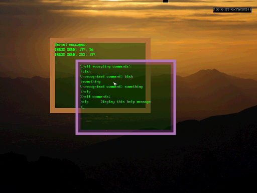

# Shipwreck OS

Shipwreck is a small OS for x86 systems. It has basic ELF support, a basic shell and a basic GUI.



- [About](#about-heading)
- [Building](#building-heading)
    * [Building natively on Linux](#building-linux-heading)
    * [Building through docker](#building-docker-heading)
- [Running](#running-heading)


## <a name="about-heading"> About </a>
This project was born out of an urge I had to build something complex from scratch. I've tinkered with OS dev in the past and wanted to build a new OS as a sort of exercise for myself. The name "Shipwreck" came from my fear of abandoning the project in some half-baked state but rather than abandon it I pruned down my goals a bit and wrapped it up.

#### Goals:

1. It should be built from scratch
> Meaning it's not a modded version of Linux or something. Everything is written from scratch, even the boot loader. It is not POSIX compliant and the standard library functions are ad-hoc. The only third-party code used is `elf.h` for the ELF header structures.

1. It should multitask
> It has a `new_thread` syscall for launching a new thread in the current process. The kernel launches a user process when it starts, but I never added `new_process` syscall for launching more processes. There are some basic IPC mechanisms like locks and monitors, and processes can subscribe to events from the OS. User input events are subscribed by default.

1. It should load a shell program from disk
> The disk image is literally just a TAR file with the boot sector slapped in front of it. On startup, the kernel starts a user process that loads an ELF executable named `shell`. Support for ELF is very minimal - e.g. it currently only looks up symbols from a program's first shared object and makes no effort to actually share the memory. The `shell` program is just a proof of concept: it sets up a GUI textbox and handles keyboard input - currently the only command is "help".

1. It should have a GUI
> This was the home stretch and a lot more fun than debugging triple-faults. Once all other parts were working to some extent (memory, events, scheduling, keyboard, video, mouse, etc) coding a basic GUI was easy. It just displays a kernel output window and the user shell window, you can drag them around and type in the shell.

## <a name="building-heading"> Building </a>

The tool chain I use is fairly common among hobby OS devs (`cmake`, `clang` and `nasm`). The `build.sh` script runs these tools to build the OS and produces a Virtual Box VMDK disk file in the `build` directory.

Because Shipwreck uses ELF objects and some fairly target-specific linker flags, the build works best natively on Linux. There are some tedious ways to cross-compile ELF binaries from a non-Linux host, but I decided the easiest way was to make a Docker image that resembles my Linux dev box with all the tools preinstalled.

### <a name="building-linux-heading"> Building natively on Linux: </a>

```
    shipwreck$ ./build.sh
```

### <a name="building-docker-heading"> Building through Docker: </a>

First, build the Docker image from the project root:

```
    shipwreck$ docker build -t buildbox .
```

This builds a Docker image based on Ubuntu with the necessary build tools installed (`cmake`, `clang`, and `nasm`).

When you launch the Docker container it will run `build.sh` to build the OS. The container expects to see the project tree in `/shipwreck`, so you'll need to map that volume when launching the container as follows:

```
    shipwreck$ docker run -it -v "$PWD":/shipwreck buildbox
```

If all goes well to this point you should see the build steps scroll by and find a new `disk-flat.vmdk` file in `/build`.

## <a name="running-heading"> Running </a>

I've only ever run Shipwreck in Oracle VirtualBox (at the time of writing I'm using VirtualBox version 5.04). I've used VMWare and Bochs for past projects, but the built-in debugger in VirtualBox really won me over.

To run Shipwreck, load `Shipwreck.vbox` in VirtualBox.

To run with the VirtualBox debugger, run:
```
    bash$ virtualbox --debug --start-running --startvm Shipwreck
```
